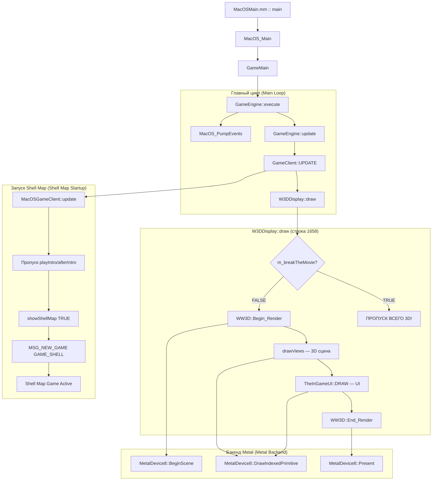

# Порт macOS — Конвейер рендеринга (Rendering Pipeline)

В этом документе подробно описывается бэкенд рендеринга Metal, который транслирует вызовы API DirectX 8 в Apple Metal.

---

## Обзор (Overview)



⚠️ **ВНИМАНИЕ (CRITICAL):** Переменная `m_breakTheMovie` должна оставаться `FALSE` на macOS. Установка её в `TRUE` приведет к тому, что `W3DDisplay::draw()` (строка 1849) пропустит вызов `WW3D::Begin_Render()`, что отключит **ВСЁ** 3D-рендеринг.

---

## Адаптер DX8 → Metal

Порт для macOS реализует интерфейсы `IDirect3D8` и `IDirect3DDevice8` (из `d3d8_stub.h`) в качестве моста к Apple Metal.

### Основные компоненты

| Компонент | Роль |
|:---|:---|
| `MetalInterface8` | Реализует `IDirect3D8` — перечисление адаптеров, создание устройства |
| `MetalDevice8` | Реализует `IDirect3DDevice8` — `MTLDevice`, `MTLCommandQueue`, `CAMetalLayer` |
| `MetalTexture8` | Реализует `IDirect3DTexture8` — обертка для `MTLTexture` |
| `MetalSurface8` | Реализует `IDirect3DSurface8` — буфер подготовки (staging) + загрузка в родительскую текстуру |
| `MetalVertexBuffer8` | Реализует `IDirect3DVertexBuffer8` — обертка для данных вершин |
| `MetalIndexBuffer8` | Реализует `IDirect3DIndexBuffer8` — обертка для данных индексов |
| `D3DXStubs.mm` | Фабричные функции — изолируют C++ от Objective-C++ |

---

## Жизненный цикл кадра (Frame Lifecycle)

### 1. `BeginScene()`
- Проверяет флаг `m_InScene`
- Создает `MTLCommandBuffer` из `m_CommandQueue`
- Получает `CAMetalDrawable` от `CAMetalLayer`

### 2. `Clear(count, rects, flags, color, z, stencil)`
- Завершает текущий кодировщик (encoder), если он есть
- Создает `MTLRenderPassDescriptor`:
  - `D3DCLEAR_TARGET` → `MTLLoadActionClear` + clearColor
  - Без `D3DCLEAR_TARGET` → `MTLLoadActionLoad`
- Создает новый `MTLRenderCommandEncoder`
- Устанавливает `MTLViewport` из `m_Viewport`

### 3. Вызовы отрисовки (Draw Calls)
`DrawPrimitive` / `DrawIndexedPrimitive` / `DrawPrimitiveUP`:

1. Получает FVF из VB через `GetBufferFVF(m_StreamSource)`
2. Получает/создает PSO через `GetPSO(fvf)` (кешируется)
3. Устанавливает PSO для кодировщика
4. Привязывает вершинный буфер: `setVertexBuffer:offset:atIndex:0`
5. Заполняет `MetalUniforms` → буфер `setVertexBytes` под индексом 1:
   - матрицы `world`, `view`, `projection`
   - `screenSize` — ширина/высота окна
   - `useProjection` — 1 (3D) или 2 (Screen Space, XYZRHW)
6. Привязывает текстуры: `setFragmentTexture:atIndex:0/1`
7. Определение примитивов (Primitive mapping):
   - `D3DPT_TRIANGLELIST` → `MTLPrimitiveTypeTriangle`
   - `D3DPT_TRIANGLESTRIP` → `MTLPrimitiveTypeTriangleStrip`
   - `D3DPT_LINELIST` → `MTLPrimitiveTypeLine`
8. `drawPrimitives` или `drawIndexedPrimitives`

### 4. `Present()`
- Вызывает `endEncoding` у текущего кодировщика
- Выполняет `presentDrawable` + `commit` для буфера команд
- Вызывает `waitUntilCompleted` для синхронизации GPU и CPU (заменяет подход с семафорами)
- Освобождает кодировщик, drawable, буфер команд

---

## Объекты состояния конвейера (PSO)

`GetPSO(DWORD fvf)` создает или извлекает из кеша (`m_PsoCache`):

### Дескриптор вершин (из FVF)

| Флаг FVF | Атрибут | Формат | Размер |
|:---|:---|:---|:---|
| `D3DFVF_XYZ` | attr[0] position | Float3 | 12B |
| `D3DFVF_XYZRHW` | attr[0] position | Float4 | 16B |
| `D3DFVF_DIFFUSE` | attr[1] color | UChar4Normalized | 4B |
| `D3DFVF_TEX1` | attr[2] texCoord0 | Float2 | 8B |
| `D3DFVF_NORMAL` | attr[3] normal | Float3 | 12B |
| `D3DFVF_SPECULAR` | attr[4] specular | UChar4Normalized | 4B |
| `D3DFVF_TEX2` | attr[5] texCoord1 | Float2 | 8B |

### Uniform буферы

| Индекс буфера | Стадия (Stage) | Содержимое |
|:---|:---|:---|
| buffer(0) | Vertex | Данные вершин (VB или inline) |
| buffer(1) | Vertex | `MetalUniforms` — World/View/Projection, screenSize, useProjection |
| buffer(2) | Fragment | `FragmentUniforms` — конфигурация TSS, textureFactor, туман, alpha test |
| buffer(3) | Vertex | `LightingUniforms` — источники света, материалы, параметры тумана |

---

## Шейдеры (`MacOSShaders.metal`)

### Вершинный шейдер (`vertex_main`)
- **Входы (Inputs):** `position` (attr 0), `color` (attr 1), `texCoord` (attr 2), `normal` (attr 3)
- **Uniforms:** `world`, `view`, `projection`, `screenSize`, `useProjection`
- **Логика:**
  - `useProjection == 1`: `pos = projection * view * world * pos` (3D преобразование)
  - `useProjection == 2`: Экранные координаты → NDC (`pos / screenSize * 2 - 1`)
  - Фактор тумана (fog factor) вычисляется на основе Z в координатах вида (view-space)

### Фрагментный шейдер (`fragment_main`)
- Сэмплирует текстуру, если установлен бит `SHIFT_TEXTURING`
- `finalColor = texColor * vertexColor`
- Alpha test: отбрасывает пиксель, если альфа < порога
- Туман: смешивается с цветом тумана `fogColor` на основе фактора тумана

---

## Пути загрузки текстур (Texture Loading Paths)

В игре есть три разных пути загрузки текстур, которые ведут себя по-разному в Windows и macOS.

### Путь A: Фоновая / Приоритетная загрузка (Стандартные модели)
Это основной способ запроса текстур при загрузке файлов `.w3d`.
1. `WW3DAssetManager::Get_Texture(name)` создает новый класс `TextureClass` с `Initialized = false`.
2. Конструктор `TextureClass::ctor(name)` на macOS вызывает `Init()` сразу (строка 772, `#ifdef __APPLE__`).
3. `Init()` вызывает `Request_Foreground_Loading(this)`.
4. **Ключевой момент:** `Request_Foreground_Loading` на строке 715 проверяет `tc->Is_Initialized()`. Если thumbnail уже установил `Initialized = true`, полная загрузка **пропускается**!
5. Если не initialized: `TextureLoadTaskClass::Finish_Load()` синхронно загружает текстуру:
   - `Begin_Load()` создает пустую `IDirect3DTexture8` через `_Create_DX8_Texture(w,h,fmt)`
   - `Load()` читает файл `.tga`/`.dds`, использует `LockRect`, копирует данные, `UnlockRect`
   - `D3DXFilterTexture()` — **stub** на macOS, возвращает S_OK (мипмапы не генерируются)

### Путь B: Прямая загрузка (D3DXCreateTextureFromFileExA)
Обычно используется для DDS файлов или специфических проходов рендеринга UI.
1. Вызывается напрямую `DX8Wrapper::_Create_DX8_Texture(filename, mip_count)`.
2. Делегирует вызов `D3DXCreateTextureFromFileExA` (который локально реализует заглушка D3DX в macOS).
3. Текстура создается полностью, данные записываются в память, и мипмапы генерируются за один шаг.

### Путь C: Загрузка миниатюр (Early Initializer)
Этот путь является источником многих проблем с текстурами на macOS.
1. При создании `TextureClass`, конструктор `TextureBaseClass` вызывает `Load_Locked_Surface()`.
2. `Load_Locked_Surface` вызывает `TextureLoader::Request_Thumbnail(this)`, устанавливает `Initialized = false`.
3. `TextureLoader::Load_Thumbnail` извлекает небольшую сжатую превью-текстуру из кешей `.tht` (128x128).
4. Вызывает `Apply_New_Surface(d3d_texture, true)`, что устанавливает `Initialized = true`.
5. Когда после этого `Init()` вызывает `Request_Foreground_Loading(this)`, проверка `Is_Initialized()` **возвращает true**, и полная загрузка **пропускается**.
6. ⚠️ **Результат:** Модели рендерятся с thumbnail текстурами (128x128, низкое качество) вместо полноразмерных.

### Текущее состояние (Февраль 2025)

- **80+ текстур** создаются через `Get_Texture()` → `TextureClass::ctor(name)` (подтверждено логами).
- **Все текстуры имеют `hasD3D=1`** — D3DTexture указатель не null.
- **Только ~3 `MetalTexture8` Created** через `MetalDevice8::CreateTexture` — остальные D3DTexture указатели указывают на **thumbnail текстуры**, загруженные через `Load_Thumbnail`.
- `TextureLoader::Update()` теперь вызывается из `W3DDisplay::draw()` каждый кадр (фикс добавлен в `#ifdef __APPLE__` блоке).
- **Белые модели**: вероятная причина — модели рендерятся с thumbnail (128x128) вместо полноразмерных текстур. Thumbnail может содержать некорректные данные или быть пустым.

### ⚠️ ВАЖНО: Диагностика логов

**`fprintf(stderr)` НЕ попадает в `game.log`** на macOS! Перенаправление `2>&1` в build_run_mac.sh не работает для stderr после старта игры (вероятно, игра или macOS перенаправляют stderr).

**Используйте только `printf` (stdout) + `fflush(stdout)` для всех диагностических логов.** Система `DLOG/DLOG_RFLOW` (MacOSDebugLog.h) использует `printf` — поэтому её логи видны.

---

## Конвейер текстур (Texture Pipeline)

### Архитектура: Текстуры, поддерживаемые буферами (Buffer-Backed Textures)

Несжатые текстуры используют **хранилище на базе буферов**: `MTLBuffer` поддерживает `MTLTexture`, и `LockRect` возвращает прямой указатель на память `MTLBuffer.contents`. Это повторяет семантику шины AGP из DX8, где `LockRect` возвращал указатель на память, отображенную в область видимости GPU.

```
┌──────────────────────────────────────────────────────┐
│  DX8 (Windows)                Metal (macOS)          │
├──────────────────────────────────────────────────────┤
│  AGP memory (shared)    →    MTLBuffer.contents      │
│  LockRect → &agpMem     →    LockRect → buf.contents │
│  GPU reads from agpMem  →    GPU reads from buf      │
│  UnlockRect = no-op     →    UnlockRect ≈ no-op      │
└──────────────────────────────────────────────────────┘
```

### Процесс создания (Buffer-Backed)
1. `CreateTexture(w, h, levels, usage, format, pool)` → `MetalTexture8`:
   - Запрашивает `minimumLinearTextureAlignmentForPixelFormat:` для выравнивания строк
   - Создает `MTLBuffer` с выровненной структурой памяти для всех уровней мипмапов
   - Для одноуровневых мипмапов (single-mip): `[buffer newTextureWithDescriptor:offset:bytesPerRow:]` — истинное отсутствие копирования (zero-copy)
   - Для многоуровневых (multi-mip): отдельная `MTLTexture` + буферное хранилище (синхронизируется через `replaceRegion` при разблокировке)
2. `GetSurfaceLevel(level)` → создает `MetalSurface8`, связанную с родителем
3. `LockRect(level)` → возвращает **прямой указатель** на `MTLBuffer.contents + mipOffset`
4. Игра записывает пиксели напрямую в видимую для GPU память
5. `UnlockRect(level)` → **no-op** для single-mip; синхронизация `replaceRegion` для multi-mip
6. `SetTexture(stage, tex)` → сохраняется в `m_Textures[stage]`
7. В вызове отрисовки: `setFragmentTexture:mtlTex atIndex:stage`

### Процесс создания (Compressed / Legacy - Сжатые/Устаревшие)
Сжатые форматы (DXT1/3/5) не могут поддерживаться буферами в Metal:
1. `CreateTexture` → отдельная `MTLTexture` с флагом `MTLStorageModeShared`
2. `LockRect` → выделяет буфер подготовки через `malloc` (staging buffer)
3. `UnlockRect` → копирует данные через `replaceRegion`, затем очищает буфер через `free`

### Жизненный цикл поверхности (Surface Lifetime)
Классы W3D (W3DShroud, TerrainTex) сохраняют указатели `pBits` от `LockRect` и записывают в них после `UnlockRect`. Это естественно работает с buffer-backed текстурами, так как указатель стабилен (это `MTLBuffer.contents`). Для пути с буфером подготовки (staging), буфер живет до деструктора `~MetalSurface8()`.

### Сопоставление форматов (Format Mapping)

| Формат D3D | Формат Metal | Buffer-Backed? |
|:---|:---|:---|
| ARGB8 / XRGB8 | `MTLPixelFormatBGRA8Unorm` | ✅ Да |
| DXT1 | `MTLPixelFormatBC1_RGBA` | ❌ Нет (staging) |
| DXT3 | `MTLPixelFormatBC2_RGBA` | ❌ Нет (staging) |
| DXT5 | `MTLPixelFormatBC3_RGBA` | ❌ Нет (staging) |
| 16-бит (R5G6B5, и т.д.) | BGRA8 (конвертируется) | ✅ Да (16→32 при разблокировке) |

---

## Процесс загрузки карты-меню (Shell Map Loading Flow)

На macOS конечный автомат (state machine) заставочного (intro) видео обходится, потому что функция `VideoPlayer::open()` возвращает `nullptr`:

```
MacOSGameClient::update()  (callCount == 0)
  → m_playIntro = FALSE
  → m_afterIntro = FALSE
  → GameClient::update()     ← базовый класс, конечный автомат пропущен
  → TheShell->showShellMap(TRUE)
    → m_pendingFile = "Maps\ShellMapMD\ShellMapMD.map"
    → Отправляется сообщение MSG_NEW_GAME (GAME_SHELL)
    → m_shellMapOn = TRUE
  → TheShell->showShell()
    → Выталкивает MainMenu.wnd на стек
    
Следующие кадры:
  → GameLogic обрабатывает MSG_NEW_GAME
  → prepareNewGame() → startNewGame(FALSE)
  → Загружается ландшафт + объекты Shell Map
  → isInGame=1, gameMode=GAME_SHELL
  → drawViews() рендерит 3D сцену
```

---

## Видимость и отсечение (Visibility & Culling)

### `RTS3DScene::Visibility_Check`

1. **Обход RenderList** — все высокоуровневые объекты `RenderObjClass`
2. **Принудительная видимость** — `robj->Is_Force_Visible()` → сразу проходит
3. **Проверка на скрытость** — `robj->Is_Hidden()` → сразу отклоняется
4. **Отсечение по пирамиде видимости (Frustum Culling)** — `camera->Cull_Sphere(robj->Get_Bounding_Sphere())`
5. **Игровая видимость (Gameplay Visibility)** — проверки скрытности (stealth), тумана войны (fog of war)
6. **Сортировка (Binning)** — полупрозрачные, перекрывающие (occluders), перекрываемые (occludees), обычные объекты

---

## Известные проблемы/недостатки (Known Gaps)

| Фича | Статус | Примечания |
|:---|:---|:---|
| DrawPrimitiveUP | ✅ Работает | Отрисовка текста 2D/UI четырехугольников работает корректно |
| Состояния Depth/Stencil | ✅ Работает | Состояние глубины создается для каждого PSO, флаг изменений отслеживается |
| Динамическое смешивание (per render state) | ✅ Работает | Закодировано в ключе кеша PSO |
| Привязка CullMode | ✅ Работает | Принудительно устанавливается MTLCullModeNone для отрисовки 2D/XYZRHW (исправление инверсии по Y) |
| Формулы TSS в шейдере | ✅ Работает | evaluateBlendOp обрабатывает SELECTARG1/2, MODULATE, ADD и др. |
| Состояния семплера (Sampler states) | ✅ Работает | Кеш состояния семплера для каждой стадии |
| Повершинное освещение (Per-vertex lighting) | ✅ Работает | Буфер uniform'ов света, до 4 направленных источников света |
| Реальные параметры тумана | ✅ Работает | Линейный/exp/exp2 туман в вершинном и фрагментном шейдерах |
| Загрузка Shell map | ✅ Работает | Обход видео + принудительный showShellMap в MacOSGameClient |
| Вызовы 3D-отрисовки | ✅ Работает | fvf=0x252, рендерятся куски ландшафта |
| Мультитекстурирование (этап 1+) | ⚠️ Частично | Привязаны stage 0+1, TSS вычисляется для двух стадий |
| Текстуры, поддерживаемые буфером (Buffer-backed) | ✅ Работает | Эмуляция AGP памяти из DX8 через MTLBuffer без копирования данных (zero-copy) |
| Ландшафтные текстуры видимы | ✅ Работает | Починено с помощью MTLStorageModeShared + buffer-backed |
| Render targets (целевые текстуры для рендера) | ❌ Не реализовано | Низкий приоритет |
| TriangleFan → TriangleList | ❌ Не реализовано | Низкий приоритет |

---

## Обходные пути для 2D-рендеринга (2D Rendering Workarounds)

Для вершин типа `D3DFVF_XYZRHW` (экранные координаты / 2D), вызов `DrawPrimitiveUP` применяет
три критических переопределения (overrides), отличающихся от стандартного 3D-рендеринга:

1. **Отключено тестирование и запись глубины (Depth test & write)** — 2D UI должен рисоваться поверх 3D-геометрии
2. **Отсечение нелицевых граней (Back-face culling) отключено** — Вершинный шейдер переворачивает координату Y для конвертации из экрана в NDC
   (`1.0 - y/screenH * 2.0`), что меняет порядок обхода вершин с CW (по часовой) на CCW (против часовой). Без отключения куллинга все 2D-треугольники бы отбрасывались.
3. **Обход проекции** — `useProjection == 2` использует трансформацию из экранных координат в NDC
   вместо стандартного конвейера матриц MVP.

---

## Рендеринг виджетов UI (W3D Gadgets)

### Архитектура

`MacOSGameWindowManager` наследуется от `W3DGameWindowManager` (а не прямо от базового `GameWindowManager`). Это дает доступ к оригинальным функциям отрисовки W3D гаджетов:

```
MacOSGameWindowManager → W3DGameWindowManager → GameWindowManager
                                 ↓
                    Функции W3DGadget*Draw
                    (PushButton, ComboBox, ListBox, 
                     Slider, ProgressBar, StaticText и т.д.)
                                 ↓
                    TheWindowManager->winDrawImage()
                                 ↓
                    TheDisplay->drawImage()
                                 ↓
                    Render2DClass → DX8Wrapper → MetalDevice8
```

### MacOSGameWindow (безопасность fontData)

`W3DGameWindow` использует `Render2DSentenceClass` для рендеринга текста, что требует `FontCharsClass` (инициализируется через GDI `CreateFont` в Windows). На macOS `fontData = nullptr`, потому что шрифты используют CoreText/NSFont через `MacOSDisplayString`.

`MacOSGameWindow` — это подкласс `W3DGameWindow`, который переопределяет:
- `winSetFont()` — пропускает `m_textRenderer.Set_Font()` (избегает краша при nullptr)
- `winSetText()` — пропускает `m_textRenderer.Build_Sentence()` 
- `drawText()` — no-op (пустышка, отрисовка текста происходит через `MacOSDisplayString`)

### Основные файлы

| Файл | Роль |
|:---|:---|
| `MacOSGameWindowManager.h` | Наследует `W3DGameWindowManager`, переопределяет `allocateNewWindow`, `winFormatText`, `winGetTextSize` |
| `MacOSGameWindowManager.mm` | Создает экземпляры `MacOSGameWindow`, рендеринг текста через `DisplayString` |
| `MacOSGadgetDraw.mm` | Устаревшие упрощенные функции отрисовки (больше не используются, но оставлены) |

---

## ✅ РЕШЕНО: Текстуры ландшафта (MTLStorageModeShared)

### Проблема

Все текстуры ландшафта отображались как ЧЕРНЫЕ (BLACK), несмотря на то, что данные корректно выгружались через `replaceRegion`.

### Коренная причина (Root Cause)

В macOS для параметра `MTLTextureDescriptor.storageMode` по умолчанию установлено значение **`MTLStorageModeManaged`** (значение `1`). При управляемом (Managed) хранилище вызов `replaceRegion` обновляет только **копию данных на стороне CPU**. GPU увидит эти изменения только после явного вызова `synchronizeResource:` через кодировщик команд (blit). Так как мы никогда не вызывали `synchronizeResource`, GPU всегда считывал нули.

### Исправление (Fix)

Установить `desc.storageMode = MTLStorageModeShared` для текстур (кроме render targets) в `MetalTexture8.mm`. В режиме Shared (общая унифицированная память на Apple Silicon) вызов `replaceRegion` пишет данные напрямую в доступную для GPU память — без необходимости какой-либо синхронизации.

```objc
// Конструктор MetalTexture8
if (usage & D3DUSAGE_RENDERTARGET) {
    desc.usage |= MTLTextureUsageRenderTarget;
    // RT использует по умолчанию Managed — Shared+RT может вызвать сбой (краш)
} else {
    desc.storageMode = MTLStorageModeShared;
}
```

### Почему затрагивался только ландшафт

Другие текстуры (3D-объекты, UI) тоже использовали режим Managed, но, казалось, работали, потому что:
- **Одноуровневые текстуры** (`m_Levels == 1`) ПЕРЕСОЗДАВАЛИСЬ с нуля в `MetalTexture8::UnlockRect`, а только что созданные текстуры с данными от `replaceRegion`, видимо, синхронизировались автоматически.
- **DDS текстуры**, загруженные через `D3DXCreateTextureFromFileExA`, также проходили через `MetalTexture8::UnlockRect` (что пересоздавало текстуру).
- **Текстуры ландшафта** использовали `MetalSurface8::UnlockRect`, который НЕ выполнял пересоздание — они вызывали `replaceRegion` для существующей Managed текстуры, что требовало явной синхронизации, которая не делалась.

---

## Terrain Rendering Pipeline Architecture

### Key Classes

| Class | File | Role |
|:---|:---|:---|
| `HeightMapRenderObjClass` | `HeightMap.cpp` | Main terrain render object (3D heightmap) |
| `FlatHeightMapRenderObjClass` | `FlatHeightMap.cpp` | Simplified low-LOD version |
| `TerrainShader2Stage` | `W3DShaderManager.cpp` | 2-stage terrain shader (minimum GPU fallback) |
| `TerrainShader8Stage` | `W3DShaderManager.cpp` | 8-stage shader (Nvidia TNT/GeForce2) |
| `TerrainShaderPixelShader` | `W3DShaderManager.cpp` | Pixel shader (modern GPUs) |
| `W3DTerrainVisual` | `W3DTerrainVisual.h` | High-level terrain visual interface |
| `BaseHeightMapRenderObjClass` | `BaseHeightMap.cpp` | Base class for all heightmap renderers |

### Multi-Pass Rendering

Terrain is rendered in **multiple passes** via `W3DShaderManager`. For `TerrainShader2Stage` (the most basic implementation, used as fallback):

#### Shader `ST_TERRAIN_BASE` — 2 passes:

**Pass 0 — Macro Texture (opaque base pass)**
```
Texture:  m_stageZeroTexture (terrain atlas) — bound to stage 0
UV set:   texCoordIndex = 0 (macro texture coordinates)
colorOp:  D3DTOP_MODULATE (texture × diffuse)
alphaOp:  D3DTOP_DISABLE
Blending: DISABLED (opaque draw)
Stage 1:  DISABLED
```

**Pass 1 — Detail Tile Blend (translucent overlay pass)**
```
Texture:  m_stageZeroTexture (same atlas, different UVs!) — bound to stage 0
UV set:   texCoordIndex = 1 (detail tile coordinates)
colorOp:  D3DTOP_MODULATE (texture × diffuse)
alphaOp:  D3DTOP_MODULATE (texture.a × diffuse.a)
Blending: ENABLED — SrcAlpha / InvSrcAlpha
Stage 1:  DISABLED
```

Vertex alpha (`diffuse.a`) controls the blend transition mask between terrain textures.

#### Noise/Cloud shaders — 3 passes:
Pass 2 adds cloud shadows and/or lightmap via `D3DTSS_TCI_CAMERASPACEPOSITION` (camera-space texture projection).

### Terrain Textures

Terrain uses a **single macro atlas** (`m_stageZeroTexture`) at 1024×1024 (format `fmt=80` = `MTLPixelFormatRGBA8Unorm`). Both texture stages (0 and 1) in `W3DShaderManager::setTexture()` point to the same atlas:

```cpp
W3DShaderManager::setTexture(0, m_stageZeroTexture);  // for pass 0 (macro UVs)
W3DShaderManager::setTexture(1, m_stageZeroTexture);  // for pass 1 (detail UVs)
```

**Important:** `W3DShaderManager::setTexture()` does NOT call `DX8Wrapper::Set_Texture()`. It only stores the pointer in `m_Textures[]` for later use by the shader. The terrain shader binds textures directly via the device:

```cpp
// Inside TerrainShader2Stage::set(pass):
DX8Wrapper::_Get_D3D_Device8()->SetTexture(0, 
    W3DShaderManager::getShaderTexture(0)->Peek_D3D_Texture());
```

### Extra Blend Tiles (3-Way Blending)

When `TheGlobalData->m_use3WayTerrainBlends` is enabled, additional tiles are drawn after the main passes via `renderExtraBlendTiles()`. This handles corner cases where 3 different textures meet. Uses `DynamicVBAccessClass` with `DX8_FVF_XYZNDUV2` format and separate VB/IB.

### Terrain FVF

Terrain uses `fvf = 0x252`:
- `D3DFVF_XYZ` (0x002) — 3D position
- `D3DFVF_DIFFUSE` (0x040) — vertex color (lighting + alpha for blend mask)
- `D3DFVF_TEX2` (0x200) — dual UV coordinates (macro + detail)
- `D3DFVF_NORMAL` (0x010) — normals for lighting

Vertices are filled in `HeightMapRenderObjClass::updateVB()`, where `diffuse` contains:
- **RGB** — static terrain lighting (`getStaticDiffuse()`)
- **Alpha** — blend tile transition mask

### HeightMapRenderObjClass::Render() Draw Order

```
1.  Set_Light_Environment() — set global lighting
2.  Set_Texture(0, nullptr) and Set_Texture(1, nullptr) — clear textures
3.  ShaderClass::Invalidate() — reset shader cache
4.  Set_Material() + Set_Shader() — set WW3D shader
5.  Set_Index_Buffer() — single IB for all tiles
6.  for (pass = 0; pass < devicePasses; pass++):
    a. W3DShaderManager::setShader(st, pass) → TerrainShader2Stage::set(pass)
       - Apply_Render_State_Changes() — applies cached states
       - Sets TSS via Set_DX8_Texture_Stage_State()
       - Binds texture via _Get_D3D_Device8()->SetTexture()
    b. for (each VB tile):
       - Set_Vertex_Buffer(vb)
       - Draw_Triangles() → Draw() → Apply_Render_State_Changes() + DrawIndexedPrimitive()
7.  renderShoreLines() — shore lines
8.  renderExtraBlendTiles() — 3-way blend tiles
9.  drawRoads() — roads
10. drawScorches() — scorch marks
11. drawBridges() — bridges
12. shroud pass — fog of war (if enabled)
```


