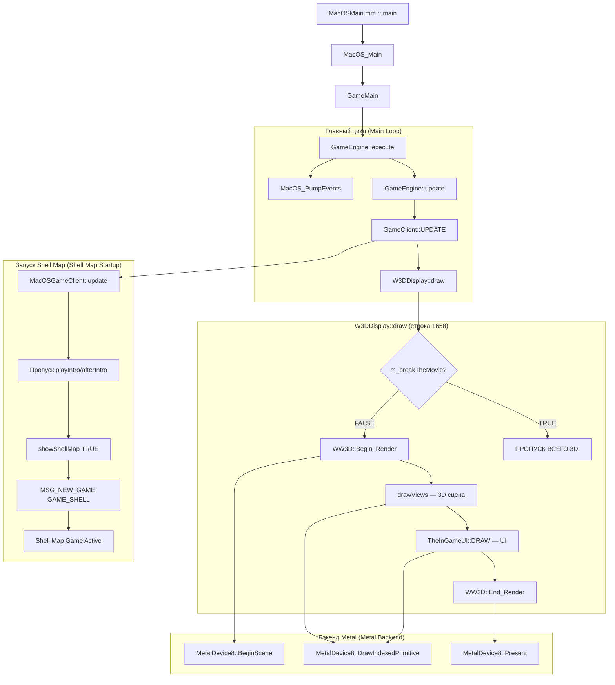

# Порт macOS — Конвейер рендеринга (Rendering Pipeline)

В этом документе подробно описывается бэкенд рендеринга Metal, который транслирует вызовы API DirectX 8 в Apple Metal.

> Обновлено: 2026-02-27

---

## Обзор (Overview)


```mermaid
graph TD
    A[MacOSMain.mm :: main] --> B[MacOS_Main]
    B --> C[GameMain]
    C --> D[GameEngine::execute]
    
    subgraph "Главный цикл (Main Loop)"
        D --> E[MacOS_PumpEvents]
        D --> F[GameEngine::update]
        F --> G[GameClient::UPDATE]
        G --> H[W3DDisplay::draw]
    end

    subgraph "W3DDisplay::draw (строка 1658)"
        H --> H0{m_breakTheMovie?}
        H0 -->|FALSE| H1[WW3D::Begin_Render]
        H0 -->|TRUE| SKIP[ПРОПУСК ВСЕГО 3D!]
        H1 --> H2[drawViews — 3D сцена]
        H2 --> H3[TheInGameUI::DRAW — UI]
        H3 --> H4[WW3D::End_Render]
    end

    subgraph "Запуск Shell Map (Shell Map Startup)"
        G --> SM[MacOSGameClient::update]
        SM --> SM1[Пропуск playIntro/afterIntro]
        SM1 --> SM2[showShellMap TRUE]
        SM2 --> SM3[MSG_NEW_GAME GAME_SHELL]
        SM3 --> SM4[Shell Map Game Active]
    end

    subgraph "Бэкенд Metal (Metal Backend)"
        H1 --> M1[MetalDevice8::BeginScene]
        H2 --> M2[MetalDevice8::DrawIndexedPrimitive]
        H3 --> M2
        H4 --> M3[MetalDevice8::Present]
    end
```

⚠️ **ВНИМАНИЕ (CRITICAL):** Переменная `m_breakTheMovie` должна оставаться `FALSE` на macOS. Установка её в `TRUE` приведет к тому, что `W3DDisplay::draw()` (строка 1849) пропустит вызов `WW3D::Begin_Render()`, что отключит **ВСЁ** 3D-рендеринг.

---

## Адаптер DX8 → Metal

Порт для macOS реализует интерфейсы `IDirect3D8` и `IDirect3DDevice8` (из `d3d8_stub.h`) в качестве моста к Apple Metal.

### Основные компоненты

| Компонент | Роль |
|:---|:---|
| `MetalInterface8` | Реализует `IDirect3D8` — перечисление адаптеров, создание устройства |
| `MetalDevice8` | Реализует `IDirect3DDevice8` — `MTLDevice`, `MTLCommandQueue`, `CAMetalLayer` |
| `MetalTexture8` | Реализует `IDirect3DTexture8` — обертка для `MTLTexture` |
| `MetalSurface8` | Реализует `IDirect3DSurface8` — буфер подготовки (staging) + загрузка в родительскую текстуру |
| `MetalVertexBuffer8` | Реализует `IDirect3DVertexBuffer8` — обертка для данных вершин |
| `MetalIndexBuffer8` | Реализует `IDirect3DIndexBuffer8` — обертка для данных индексов |
| `D3DXStubs.mm` | Фабричные функции — изолируют C++ от Objective-C++ |

---

## Жизненный цикл кадра (Frame Lifecycle)

### 1. `BeginScene()`
- Проверяет флаг `m_InScene`
- Создает `MTLCommandBuffer` из `m_CommandQueue`
- Получает `CAMetalDrawable` от `CAMetalLayer`
- Поддерживает множественные `BeginScene/EndScene` за кадр (для RTT проходов)

### 2. `Clear(count, rects, flags, color, z, stencil)`
- Завершает текущий кодировщик (encoder), если он есть
- Создает `MTLRenderPassDescriptor`:
  - `D3DCLEAR_TARGET` → `MTLLoadActionClear` + clearColor (alpha принудительно 1.0)
  - Без `D3DCLEAR_TARGET` → `MTLLoadActionLoad`
- Depth/Stencil: `Depth32Float_Stencil8`
- Создает новый `MTLRenderCommandEncoder`
- Устанавливает `MTLViewport` из `m_Viewport`
- Автоматически вызывает `BeginScene()` если вызван до него (WW3D вызывает Clear до BeginScene)

### 3. Вызовы отрисовки (Draw Calls)
`DrawPrimitive` / `DrawIndexedPrimitive` / `DrawPrimitiveUP`:

1. Получает FVF из VB через `GetBufferFVF(m_StreamSource)`
2. Получает/создает PSO через `GetPSO(fvf, stride)` (кешируется по ключу fvf+blend state)
3. Устанавливает PSO для кодировщика
4. Применяет per-draw state: cull mode, depth/stencil
5. Привязывает вершинный буфер: `setVertexBuffer:offset:atIndex:0`
6. Привязывает missing-attribute zero buffer: `setVertexBuffer:atIndex:30`
7. Заполняет `MetalUniforms` → буфер `setVertexBytes` под индексом 1:
   - матрицы `world`, `view`, `projection`
   - `screenSize` — ширина/высота окна
   - `useProjection` — 1 (3D) или 2 (Screen Space, XYZRHW)
   - `texMatrix[4]` — текстурные матрицы D3DTS_TEXTURE0..3
   - `texTransformFlags[4]` — D3DTSS_TEXTURETRANSFORMFLAGS per stage
8. Заполняет `FragmentUniforms` → буфер 2:
   - TSS конфигурация (4 стадии: colorOp/alphaOp/args)
   - `textureFactor`, `fogColor/Start/End/Density/Mode`
   - `alphaTestEnable/Func/Ref`
   - `hasTexture[4]`, `texCoordIndex[4]`, `texFormatType[4]`
   - `specularEnable`
9. Заполняет `LightingUniforms` → буфер 3:
   - До 4 источников света (directional/point/spot)
   - Material properties (diffuse/ambient/specular/emissive/power)
   - Material color source mode (D3DMCS_MATERIAL/COLOR1/COLOR2)
   - Vertex fog parameters
10. Если PS активен: `CustomPSUniforms` → буфер 5
11. Если custom VS активен: `CustomVSUniforms` → буфер 4
12. Привязывает текстуры: `setFragmentTexture:atIndex:0..3`
13. Привязывает семплеры: `setFragmentSamplerState:atIndex:0..3`
14. Определение примитивов (Primitive mapping):
   - `D3DPT_TRIANGLELIST` → `MTLPrimitiveTypeTriangle`
   - `D3DPT_TRIANGLESTRIP` → `MTLPrimitiveTypeTriangleStrip`
   - `D3DPT_LINELIST` → `MTLPrimitiveTypeLine`
   - `D3DPT_LINESTRIP` → `MTLPrimitiveTypeLineStrip`
   - `D3DPT_POINTLIST` → `MTLPrimitiveTypePoint`
15. `drawPrimitives` или `drawIndexedPrimitives`

### 4. `Present()`
- Вызывает `endEncoding` у текущего кодировщика
- Выполняет `presentDrawable` + `commit` для буфера команд
- Вызывает `waitUntilCompleted` для синхронизации GPU и CPU
- Освобождает кодировщик, drawable, буфер команд

---

## Объекты состояния конвейера (PSO)

`GetPSO(DWORD fvf, UINT stride)` создает или извлекает из кеша (`m_PsoCache`).

Ключ PSO: `uint64_t` кодирует fvf + blend enable + src/dst blend + color write mask + stride.

### Дескриптор вершин (из FVF)

| Флаг FVF | Атрибут | Формат | Размер |
|:---|:---|:---|:---|
| `D3DFVF_XYZ` | attr[0] position | Float3 | 12B |
| `D3DFVF_XYZRHW` | attr[0] position | Float4 | 16B |
| `D3DFVF_NORMAL` | attr[3] normal | Float3 | 12B |
| `D3DFVF_DIFFUSE` | attr[1] color | UChar4Normalized_BGRA | 4B |
| `D3DFVF_SPECULAR` | attr[4] specular | UChar4Normalized_BGRA | 4B |
| `D3DFVF_TEX1` | attr[2] texCoord0 | Float2 | 8B |
| `D3DFVF_TEX2` | attr[5] texCoord1 | Float2 | 8B |

> **Примечание:** Порядок полей в FVF memory layout: position → normal → diffuse → specular → texcoords. Stride берётся от вызывающего кода (для учёта padding в C++ структурах), а не вычисляется как сумма атрибутов.

### Missing Attribute Defaults (buffer 30)
FVF может не содержать все 6 атрибутов. Неиспользуемые атрибуты подключаются к `m_ZeroBuffer` (layout 30, MTLVertexStepFunctionConstant):
- Missing position: (0,0,0)
- Missing diffuse: white (0xFFFFFFFF)
- Missing texCoord: (0,0)
- Missing normal: (0,0,0)
- Missing specular: black (0x00000000)

### Uniform буферы

| Индекс буфера | Стадия (Stage) | Содержимое |
|:---|:---|:---|
| buffer(0) | Vertex | Данные вершин (VB или inline) |
| buffer(1) | Vertex + Fragment | `MetalUniforms` — MVP, screenSize, texMatrix[4], texTransformFlags[4] |
| buffer(2) | Fragment | `FragmentUniforms` — TSS конфиг, textureFactor, туман, alpha test, texCoordIndex, texFormatType |
| buffer(3) | Vertex | `LightingUniforms` — до 4 источников света, материалы, fog params |
| buffer(4) | Vertex | `CustomVSUniforms` — shaderType + VS constant registers c0..c33 |
| buffer(5) | Fragment | `CustomPSUniforms` — psType + PS constant registers c0..c7 |
| buffer(30) | Vertex | Zeros buffer для missing FVF attributes |

---

## Шейдеры (`MacOSShaders.metal`)

### Вершинный шейдер (`vertex_main`)

Единый шейдер с тремя путями:

#### 1. Custom Vertex Shader: Trees (shaderType == 1)
Реализует `Trees.vso`:
- c4-c7: World-View-Projection матрица (transposed row-major)
- Sway displacement: swayType кодирован в diffuse alpha (1-based index)
- swayWeight = normal.z (высота над землёй)
- Shroud UV: c32 (offset) + c33 (scale)
- Alpha восстанавливается в 1.0 (alpha был использован для swayType)

#### 2. Custom Vertex Shader: Water Wave (shaderType == 2)
Реализует `wave.vso`:
- c2-c5: WVP матрица (transposed)
- UV0: pass-through
- UV1: текстурная проекция для отражения (c6-c9)

#### 3. Standard vertex shader (shaderType == 0)
- `useProjection == 1`: `pos = projection * view * world * pos` (3D)
- `useProjection == 2`: Экранные координаты → NDC (`pos / screenSize * 2 - 1`, Y-flip)
- Camera-space position вычисляется для D3DTSS_TCI_CAMERASPACEPOSITION
- Per-vertex lighting (DX8 FFP):
  - До 4 источников света (directional, point, spot)
  - Material color source (D3DMCS_MATERIAL/COLOR1/COLOR2)
  - DX8 формулы: ambient + diffuse (N·L) + specular (N·H)^power
  - Attenuation: 1/(a0 + a1*d + a2*d²)
  - Spotlight: inner/outer cone с falloff

#### Fog (все пути)
- Линейный: `(fogEnd - dist) / (fogEnd - fogStart)`
- Exp: `exp(-density * dist)`
- Exp2: `exp(-(density * dist)²)`
- 2D вершины: fogFactor = 1.0 (UI без тумана)

### Фрагментный шейдер (`fragment_main`)

Два основных пути:

#### Путь A: Custom Pixel Shader (psUniforms.psType != 0)
Обходит TSS. Определяет тип PS по bytecode-анализу в `CreatePixelShader`:

| psType | Название | Описание |
|:---|:---|:---|
| 1 | `PS_TERRAIN` | `lrp r0, v0.a, t0, t1` — terrain blend by vertex alpha |
| 2 | `PS_TERRAIN_NOISE1` | terrain + cloud texture (stage 2) |
| 3 | `PS_TERRAIN_NOISE2` | terrain + cloud + noise (stages 2-3) |
| 4 | `PS_ROAD_NOISE2` | road: t0 * t1 * t2, alpha = t0.a |
| 5 | `PS_MONOCHROME` | luminance = dot(t0.rgb, c0.rgb) * c1 * c2 |
| 6 | `PS_WAVE` | bump water: t1 * c0 (reflection factor) |
| 7 | `PS_FLAT_TERRAIN` | simplified terrain blend |
| 8 | `PS_FLAT_TERRAIN0` | same as flat terrain |
| 9 | `PS_FLAT_TERRAIN_NOISE1` | flat terrain + cloud |
| 10 | `PS_FLAT_TERRAIN_NOISE2` | flat terrain + cloud + noise |

PS bytecode classification в `CreatePixelShader` использует:
- Количество tex инструкций
- Наличие dp3 (monochrome), lrp (terrain blend), texbem (water bump)

#### Путь B: TSS Pipeline (psType == 0)
Полный TSS processing для D3DTOP операций:
- 4 стадии (stages 0-3), каждая с colorOp и alphaOp
- `resolveArg()`: D3DTA_DIFFUSE, CURRENT, TEXTURE, TFACTOR, SPECULAR + modifiers (COMPLEMENT, ALPHAREPLICATE)
- `evaluateBlendOp()`: BLENDDIFFUSEALPHA, BLENDTEXTUREALPHA, BLENDFACTORALPHA, BLENDCURRENTALPHA
- `evaluateOp()`: SELECTARG1/2, MODULATE/2X/4X, ADD, ADDSIGNED/2X, SUBTRACT, ADDSMOOTH, DOTPRODUCT3, MODULATEALPHA_ADDCOLOR и др.

#### UV Computation
- `computeUV()` (TSS path): поддерживает TCI_PASSTHRU и TCI_CAMERASPACEPOSITION с текстурными матрицами
- `computeUVPS()` (PS path): аналогично, но без texTransformFlags для PASSTHRU

#### Texture Format Unpacking
Luminance форматы (L8, P8, A8L8, A4L4):
- `texFormatType == 1`: RGB = texture.r, A = 1.0
- `texFormatType == 2`: RGB = texture.r, A = texture.g

#### Post-processing
1. Alpha test: D3DCMP operations
2. Fog: `mix(fogColor, color, fogFactor)`
3. Specular add: if `D3DRS_SPECULARENABLE`
4. Black discard: опaque черные (0,0,0,1) пиксели из DXT1 → `discard_fragment()` (workaround)

---

## Конвейер текстур (Texture Pipeline)

### Архитектура: Текстуры, поддерживаемые буферами (Buffer-Backed Textures)

Несжатые текстуры используют **хранилище на базе буферов**: `MTLBuffer` поддерживает `MTLTexture`, и `LockRect` возвращает прямой указатель на память `MTLBuffer.contents`. Это повторяет семантику шины AGP из DX8.

```
┌──────────────────────────────────────────────────────┐
│  DX8 (Windows)                Metal (macOS)          │
├──────────────────────────────────────────────────────┤
│  AGP memory (shared)    →    MTLBuffer.contents      │
│  LockRect → &agpMem     →    LockRect → buf.contents │
│  GPU reads from agpMem  →    GPU reads from buf      │
│  UnlockRect = no-op     →    UnlockRect ≈ no-op      │
└──────────────────────────────────────────────────────┘
```

### Процесс создания (Buffer-Backed)
1. `CreateTexture(w, h, levels, usage, format, pool)` → `MetalTexture8`:
   - Запрашивает `minimumLinearTextureAlignmentForPixelFormat:` для выравнивания строк
   - Создает `MTLBuffer` с выровненной структурой памяти для всех уровней мипмапов
   - Для одноуровневых мипмапов (single-mip): `[buffer newTextureWithDescriptor:offset:bytesPerRow:]` — zero-copy
   - Для многоуровневых (multi-mip): отдельная `MTLTexture` + буферное хранилище (синхронизируется через `replaceRegion` при разблокировке)
2. `GetSurfaceLevel(level)` → создает `MetalSurface8`, связанную с родителем
3. `LockRect(level)` → возвращает **прямой указатель** на `MTLBuffer.contents + mipOffset`
4. Игра записывает пиксели напрямую в видимую для GPU память
5. `UnlockRect(level)` → **no-op** для single-mip; синхронизация `replaceRegion` для multi-mip
6. `SetTexture(stage, tex)` → сохраняется в `m_Textures[stage]`
7. В вызове отрисовки: `setFragmentTexture:mtlTex atIndex:stage`

### Процесс создания (Compressed / Legacy - Сжатые/Устаревшие)
Сжатые форматы (DXT1/3/5) не могут поддерживаться буферами в Metal:
1. `CreateTexture` → отдельная `MTLTexture` с флагом `MTLStorageModeShared`
2. `LockRect` → выделяет буфер подготовки через `malloc` (staging buffer)
3. `UnlockRect` → копирует данные через `replaceRegion`, затем очищает буфер через `free`

### Жизненный цикл поверхности (Surface Lifetime)
Классы W3D (W3DShroud, TerrainTex) сохраняют указатели `pBits` от `LockRect` и записывают в них после `UnlockRect`. Это естественно работает с buffer-backed текстурами, так как указатель стабилен (это `MTLBuffer.contents`). Для пути с буфером подготовки (staging), буфер живет до деструктора `~MetalSurface8()`.

### Сопоставление форматов (Format Mapping)

| Формат D3D | Формат Metal | Buffer-Backed? |
|:---|:---|:---|
| ARGB8 / XRGB8 | `MTLPixelFormatBGRA8Unorm` | ✅ Да |
| DXT1 | `MTLPixelFormatBC1_RGBA` | ❌ Нет (staging) |
| DXT3 | `MTLPixelFormatBC2_RGBA` | ❌ Нет (staging) |
| DXT5 | `MTLPixelFormatBC3_RGBA` | ❌ Нет (staging) |
| L8 / P8 | `MTLPixelFormatR8Unorm` | ✅ Да |
| A8L8 / A4L4 / A8P8 | `MTLPixelFormatRG8Unorm` | ✅ Да |
| 16-бит (R5G6B5, и т.д.) | BGRA8 (конвертируется) | ✅ Да (16→32 при разблокировке) |

### ⚠️ Кэширование текстур (Texture Cache Bypass)

На Windows `DX8Wrapper::Set_DX8_Texture()` кэширует привязку по указателю:
```cpp
if (Textures[stage] == texture) return; // skip redundant SetTexture
```

На Metal этот кэш **отключён** (`#ifndef __APPLE__`), потому что 2D UI переиспользует тот же `IDirect3DTexture8*` указатель с разным содержимым (динамический текстовый рендеринг через LockRect/UnlockRect). Без bypass кэш отфильтровывает вызов, но Metal привязывает ту же MTLTexture — данные обновлены, но в edge cases (пересоздание MTLTexture при unlock, переиспользование адреса аллокатором) могут быть stale bindings.

**Решение (запланировано):** generation counter в MetalTexture8 — инкрементируется при каждом UnlockRect, позволяет кэшировать статические текстуры (~95% вызовов) и корректно обновлять динамические.

---

## Пути загрузки текстур (Texture Loading Paths)

В игре есть три разных пути загрузки текстур.

### Путь A: Фоновая / Приоритетная загрузка (Стандартные модели)
Основной способ запроса текстур при загрузке файлов `.w3d`.
1. `WW3DAssetManager::Get_Texture(name)` создает `TextureClass` с `Initialized = false`
2. Конструктор на macOS вызывает `Init()` сразу (`#ifdef __APPLE__`)
3. `Init()` → `Request_Foreground_Loading(this)`
4. `TextureLoadTaskClass::Finish_Load()` синхронно загружает текстуру

### Путь B: Прямая загрузка (D3DXCreateTextureFromFileExA)
Для DDS файлов или специфических проходов рендеринга UI.
1. `DX8Wrapper::_Create_DX8_Texture(filename, mip_count)`
2. Делегирует `D3DXCreateTextureFromFileExA` (macOS stub)
3. Текстура создается полностью за один шаг

### Путь C: Загрузка миниатюр (Early Initializer)
1. Конструктор `TextureBaseClass` → `Load_Locked_Surface()` → `Request_Thumbnail(this)`
2. `Load_Thumbnail` извлекает 128x128 превью из `.tht` кешей
3. `Apply_New_Surface()` устанавливает `Initialized = true`
4. `TextureLoader::Update()` вызывается из `W3DDisplay::draw()` каждый кадр для дозагрузки полноразмерных текстур

---

## Процесс загрузки карты-меню (Shell Map Loading Flow)

На macOS конечный автомат intro видео обходится (VideoPlayer::open → nullptr):

```
MacOSGameClient::update()  (callCount == 0)
  → m_playIntro = FALSE
  → m_afterIntro = FALSE
  → GameClient::update()     ← базовый класс, конечный автомат пропущен
  → TheShell->showShellMap(TRUE)
    → m_pendingFile = "Maps\ShellMapMD\ShellMapMD.map"
    → Отправляется сообщение MSG_NEW_GAME (GAME_SHELL)
    → m_shellMapOn = TRUE
  → TheShell->showShell()
    → Выталкивает MainMenu.wnd на стек
    
Следующие кадры:
  → GameLogic обрабатывает MSG_NEW_GAME
  → prepareNewGame() → startNewGame(FALSE)
  → Загружается ландшафт + объекты Shell Map
  → isInGame=1, gameMode=GAME_SHELL
  → drawViews() рендерит 3D сцену
```

---

## Видимость и отсечение (Visibility & Culling)

### `RTS3DScene::Visibility_Check`

1. **Обход RenderList** — все высокоуровневые объекты `RenderObjClass`
2. **Принудительная видимость** — `robj->Is_Force_Visible()` → сразу проходит
3. **Проверка на скрытость** — `robj->Is_Hidden()` → сразу отклоняется
4. **Отсечение по пирамиде видимости (Frustum Culling)** — `camera->Cull_Sphere(robj->Get_Bounding_Sphere())`
5. **Игровая видимость (Gameplay Visibility)** — проверки скрытности (stealth), тумана войны (fog of war)
6. **Сортировка (Binning)** — полупрозрачные, перекрывающие (occluders), перекрываемые (occludees), обычные объекты

---

## Render State Coverage

### ✅ Полностью реализовано
- World/View/Projection transforms
- Texture transforms (D3DTS_TEXTURE0..3) с texTransformFlags
- Per-vertex lighting (до 4 источников: directional, point, spot)
- Material properties + color source modes (D3DMCS)
- Alpha test (все D3DCMP операции)
- Alpha blend (динамический state, закодирован в PSO key)
- Depth test/write (per-PSO depth stencil state)
- Stencil operations
- Fog (linear, exp, exp2 — vertex fog + fragment fog)
- Specular enable/disable (post-TSS additive specular)
- Pixel shaders (PS 1.1, 10 типов — bytecode classification)
- Custom vertex shaders (Trees.vso, Wave.vso)
- FVF vertex shaders (автоматическое определение layout из FVF)
- Texture binding (4 stages + 4 samplers)
- Sampler states (min/mag/mip filter, address modes U/V/W)
- TSS pipeline (4 stages, все D3DTOP operations)
- Texture coordinate indexing (D3DTSS_TEXCOORDINDEX: UV set selection + TCI modes)
- Camera-space texture projection (D3DTSS_TCI_CAMERASPACEPOSITION)
- Texture format unpacking (luminance L8, A8L8, palettized P8)
- Color write mask (D3DRS_COLORWRITEENABLE → MTLColorWriteMask)
- DrawPrimitiveUP (2D/UI quads)
- DrawPrimitive (3D non-indexed)
- DrawIndexedPrimitive (3D indexed)
- Cull mode (MTLCullModeNone for 2D, per-state for 3D)

### ⚠️ Workarounds (осознанный tech debt)
- **Texture cache disabled** — 2D UI переиспользует D3D указатели с новым контентом. Запланировано: generation counter
- **Black fragment discard** — DXT1 пустые блоки → opaque black. Root cause: texture loading pipeline
- **TriangleFan → не конвертируется** — движок не использует TriangleFan на этой карте

### Stubs (no-op, безопасные)
- Clip planes (no-op, rarely used)
- Gamma ramp (applied once, cosmetic)
- Volume/Cube textures (return nullptr, engine gracefully falls back)

### ❌ Не реализовано (нет вызывающих или low priority)
- DrawIndexedPrimitiveUP (0 engine callers)
- Additional swap chains (Metal single-layer)
- Render targets (SetRenderTarget → no-op, low priority)

---

## Обходные пути для 2D-рендеринга (2D Rendering Workarounds)

Для вершин типа `D3DFVF_XYZRHW` (экранные координаты / 2D), вызов `DrawPrimitiveUP` применяет
три критических переопределения (overrides), отличающихся от стандартного 3D-рендеринга:

1. **Отключено тестирование и запись глубины (Depth test & write)** — 2D UI должен рисоваться поверх 3D-геометрии
2. **Отсечение нелицевых граней (Back-face culling) отключено** — Вершинный шейдер переворачивает координату Y для конвертации из экрана в NDC
   (`1.0 - y/screenH * 2.0`), что меняет порядок обхода вершин с CW → CCW. Без отключения куллинга все 2D-треугольники бы отбрасывались.
3. **Обход проекции** — `useProjection == 2` использует трансформацию из экранных координат в NDC
   вместо стандартного конвейера матриц MVP.

---

## Рендеринг виджетов UI (W3D Gadgets)

### Архитектура

`MacOSGameWindowManager` наследуется от `W3DGameWindowManager` (а не прямо от базового `GameWindowManager`). Это дает доступ к оригинальным функциям отрисовки W3D гаджетов:

```
MacOSGameWindowManager → W3DGameWindowManager → GameWindowManager
                                 ↓
                    Функции W3DGadget*Draw
                    (PushButton, ComboBox, ListBox, 
                     Slider, ProgressBar, StaticText и т.д.)
                                 ↓
                    TheWindowManager->winDrawImage()
                                 ↓
                    TheDisplay->drawImage()
                                 ↓
                    Render2DClass → DX8Wrapper → MetalDevice8
```

### MacOSGameWindow (безопасность fontData)

`W3DGameWindow` использует `Render2DSentenceClass` для рендеринга текста, что требует `FontCharsClass` (инициализируется через GDI `CreateFont` в Windows). На macOS `fontData = nullptr`, потому что шрифты используют CoreText/NSFont через `MacOSDisplayString`.

`MacOSGameWindow` — это подкласс `W3DGameWindow`, который переопределяет:
- `winSetFont()` — пропускает `m_textRenderer.Set_Font()` (избегает краша при nullptr)
- `winSetText()` — пропускает `m_textRenderer.Build_Sentence()` 
- `drawText()` — no-op (отрисовка текста через `MacOSDisplayString`)

### Основные файлы

| Файл | Роль |
|:---|:---|
| `MacOSGameWindowManager.h` | Наследует `W3DGameWindowManager`, переопределяет `allocateNewWindow`, `winFormatText`, `winGetTextSize` |
| `MacOSGameWindowManager.mm` | Создает экземпляры `MacOSGameWindow`, рендеринг текста через `DisplayString` |
| `MacOSGadgetDraw.mm` | Устаревшие упрощённые функции отрисовки (оставлены для справки) |

---

## ✅ РЕШЕНО: Текстуры ландшафта (MTLStorageModeShared)

### Проблема
Все текстуры ландшафта отображались как ЧЕРНЫЕ (BLACK), несмотря на то, что данные корректно выгружались через `replaceRegion`.

### Коренная причина
В macOS `MTLTextureDescriptor.storageMode` по умолчанию = `MTLStorageModeManaged`. При Managed storage `replaceRegion` обновляет только CPU-копию. GPU увидит изменения только после `synchronizeResource:`. Мы никогда не вызывали `synchronizeResource` → GPU читал нули.

### Исправление
`desc.storageMode = MTLStorageModeShared` для текстур (кроме render targets). На Apple Silicon Shared = unified memory, `replaceRegion` пишет сразу в GPU-доступную память.

---

## Terrain Rendering Pipeline Architecture

### Key Classes

| Class | File | Role |
|:---|:---|:---|
| `HeightMapRenderObjClass` | `HeightMap.cpp` | Main terrain render object (3D heightmap) |
| `FlatHeightMapRenderObjClass` | `FlatHeightMap.cpp` | Simplified low-LOD version |
| `TerrainShader2Stage` | `W3DShaderManager.cpp` | 2-stage terrain shader (minimum GPU fallback) |
| `TerrainShader8Stage` | `W3DShaderManager.cpp` | 8-stage shader (Nvidia TNT/GeForce2) |
| `TerrainShaderPixelShader` | `W3DShaderManager.cpp` | Pixel shader (modern GPUs) |
| `W3DTerrainVisual` | `W3DTerrainVisual.h` | High-level terrain visual interface |
| `BaseHeightMapRenderObjClass` | `BaseHeightMap.cpp` | Base class for all heightmap renderers |

### Multi-Pass Rendering

Terrain is rendered in **multiple passes** via `W3DShaderManager`. For `TerrainShader2Stage` (the most basic implementation, used as fallback):

#### Shader `ST_TERRAIN_BASE` — 2 passes:

**Pass 0 — Macro Texture (opaque base pass)**
```
Texture:  m_stageZeroTexture (terrain atlas) — bound to stage 0
UV set:   texCoordIndex = 0 (macro texture coordinates)
colorOp:  D3DTOP_MODULATE (texture × diffuse)
alphaOp:  D3DTOP_DISABLE
Blending: DISABLED (opaque draw)
Stage 1:  DISABLED
```

**Pass 1 — Detail Tile Blend (translucent overlay pass)**
```
Texture:  m_stageZeroTexture (same atlas, different UVs!) — bound to stage 0
UV set:   texCoordIndex = 1 (detail tile coordinates)
colorOp:  D3DTOP_MODULATE (texture × diffuse)
alphaOp:  D3DTOP_MODULATE (texture.a × diffuse.a)
Blending: ENABLED — SrcAlpha / InvSrcAlpha
Stage 1:  DISABLED
```

Vertex alpha (`diffuse.a`) controls the blend transition mask between terrain textures.

#### Noise/Cloud shaders — 3 passes:
Pass 2 adds cloud shadows and/or lightmap via `D3DTSS_TCI_CAMERASPACEPOSITION` (camera-space texture projection).

#### Pixel Shader terrain path
When GPU supports PS 1.1 (always on Metal), `TerrainShaderPixelShader` is used instead. This reduces terrain to 1-2 passes:
- PS does the `lrp` blend (t0↔t1 by vertex alpha) in a single pass
- Noise/cloud stages are added as additional texture fetches within the same PS

### Terrain Textures

Terrain uses a **single macro atlas** (`m_stageZeroTexture`) at 1024×1024 (format `fmt=80` = `MTLPixelFormatRGBA8Unorm`). Both texture stages (0 and 1) in `W3DShaderManager::setTexture()` point to the same atlas:

```cpp
W3DShaderManager::setTexture(0, m_stageZeroTexture);  // for pass 0 (macro UVs)
W3DShaderManager::setTexture(1, m_stageZeroTexture);  // for pass 1 (detail UVs)
```

**Important:** `W3DShaderManager::setTexture()` does NOT call `DX8Wrapper::Set_Texture()`. It only stores the pointer in `m_Textures[]`. The terrain shader binds textures directly via the device:

```cpp
// Inside TerrainShader2Stage::set(pass):
DX8Wrapper::_Get_D3D_Device8()->SetTexture(0, 
    W3DShaderManager::getShaderTexture(0)->Peek_D3D_Texture());
```

### Extra Blend Tiles (3-Way Blending)

When `TheGlobalData->m_use3WayTerrainBlends` is enabled, additional tiles are drawn after the main passes via `renderExtraBlendTiles()`. Uses `DynamicVBAccessClass` with `DX8_FVF_XYZNDUV2` format and separate VB/IB.

### Terrain FVF

Terrain uses `fvf = 0x252`:
- `D3DFVF_XYZ` (0x002) — 3D position
- `D3DFVF_NORMAL` (0x010) — normals for lighting
- `D3DFVF_DIFFUSE` (0x040) — vertex color (lighting + alpha for blend mask)
- `D3DFVF_TEX2` (0x200) — dual UV coordinates (macro + detail)

Vertices are filled in `HeightMapRenderObjClass::updateVB()`, where `diffuse` contains:
- **RGB** — static terrain lighting (`getStaticDiffuse()`)
- **Alpha** — blend tile transition mask

### HeightMapRenderObjClass::Render() Draw Order

```
1.  Set_Light_Environment() — set global lighting
2.  Set_Texture(0, nullptr) and Set_Texture(1, nullptr) — clear textures
3.  ShaderClass::Invalidate() — reset shader cache
4.  Set_Material() + Set_Shader() — set WW3D shader
5.  Set_Index_Buffer() — single IB for all tiles
6.  for (pass = 0; pass < devicePasses; pass++):
    a. W3DShaderManager::setShader(st, pass) → TerrainShader2Stage::set(pass)
       - Apply_Render_State_Changes() — applies cached states
       - Sets TSS via Set_DX8_Texture_Stage_State()
       - Binds texture via _Get_D3D_Device8()->SetTexture()
    b. for (each VB tile):
       - Set_Vertex_Buffer(vb)
       - Draw_Triangles() → Draw() → Apply_Render_State_Changes() + DrawIndexedPrimitive()
7.  renderShoreLines() — shore lines
8.  renderExtraBlendTiles() — 3-way blend tiles
9.  drawRoads() — roads
10. drawScorches() — scorch marks
11. drawBridges() — bridges
12. shroud pass — fog of war (if enabled)
```

---

## Известные визуальные баги

| Баг | Severity | Вероятная причина |
|:---|:---|:---|
| White squares (particle splash) | 🟡 | Формат текстуры партиклов (DXT1 vs DXT3) или blend mode |
| Black shadow on mountain back | 🟡 | DXT1 пустые блоки не ловятся порогом discard |
| Terrain texture simplified | 🟡 | PS path не применяет texTransformFlags (computeUVPS) |

---

## ⚠️ ВАЖНО: Диагностика логов

**`fprintf(stderr)` НЕ попадает в `game.log`** на macOS!

**Используйте только `printf` (stdout) + `fflush(stdout)` для всех диагностических логов.** Система `DLOG/DLOG_RFLOW` (MacOSDebugLog.h) использует `printf` — поэтому её логи видны.
